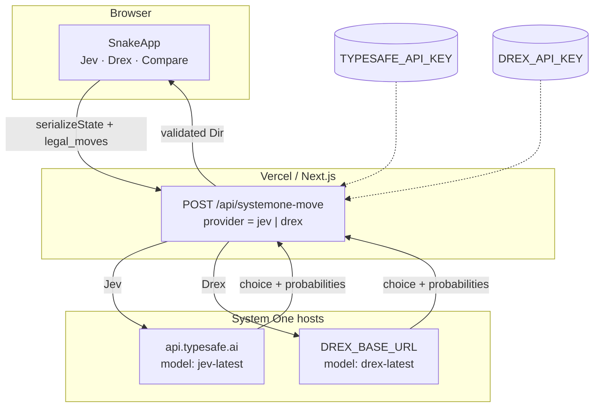
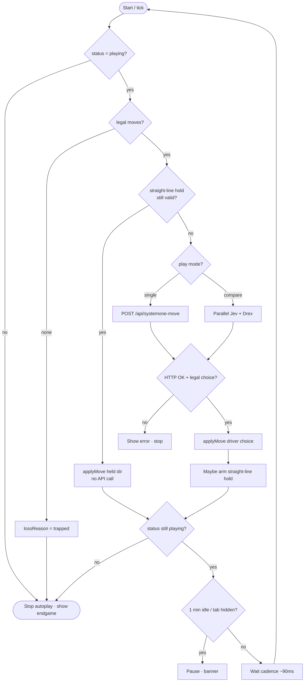
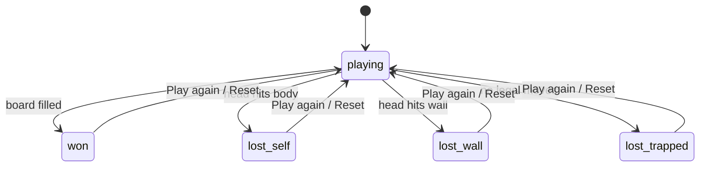

# Jev Snake (Web)

Snake autoplay where **every move decision** is a live System One Choice via `POST /v1/systemone`. Pick **Jev** (TypeSafe), **Drex**, or **Compare both** side by side. Safe straight-line holds may reuse the last legal direction without a new API call.


## Live

| | |
|---|---|
| Production | https://jev-snake-theta.vercel.app |
| Vercel project | https://vercel.com/apptonics-projects/jev-snake |
| GitHub | https://github.com/lalitsonawane/jev-snake |

## Win & lose (classic rules)

| Outcome | Rule |
|---------|------|
| **Win** | Snake length fills the board (`length === width × height`) |
| **Self crash** | Head moves onto a body cell (not the vacating tail) |
| **Wall** | Head leaves the board |
| **Trapped** | No legal moves remain |


## Models: Jev, Drex, Compare

| Mode | Behavior |
|------|----------|
| **Jev** | Autoplay driven by TypeSafe `jev-latest` |
| **Drex** | Autoplay driven by Drex `drex-latest` (wire-compatible System One) |
| **Compare** | Same `state` + `questions` sent to both in parallel; probabilities shown side by side. Pick which model's choice **drives** the snake (default Jev). |

Drex is wire-compatible with TypeSafe Jev (`noul` / `choice` / `score`). The TypeSafe SDK can talk to Drex by swapping three settings: API key, base URL, and default model (`drex-latest`). Some TypeSafe-shaped requests may return `422` from Drex on purpose (stricter validation).

## Architecture



## Autoplay tick flow



## Endgame state machine



## Security

Keys are read **only** in the server Route Handler (`src/lib/systemone.ts` via `/api/systemone-move`). Never sent to the browser.

| Provider | API key env | Base URL env | Default base | Model |
|----------|-------------|--------------|--------------|-------|
| Jev | `TYPESAFE_API_KEY` (alias `TYPE_SAFE_API_KEY`) | `TYPESAFE_BASE_URL` (optional) | `https://api.typesafe.ai` | `jev-latest` |
| Drex | `DREX_API_KEY` | `DREX_BASE_URL` (optional) | `https://api.drex.ai` | `drex-latest` |

Pause/reset aborts the browser `fetch` to `/api/systemone-move`; the route forwards `req.signal` so upstream calls are cancelled too. `/api/jev-move` remains as a Jev-only alias.

> **Base URL note:** Public Drex host docs were sparse at ship time. Default is `https://api.drex.ai` (TypeSafe-shaped). If your tenant uses another host, set `DREX_BASE_URL` to that root (no `/v1/systemone` suffix — the app appends it).

## Local

```bash
export TYPESAFE_API_KEY=...          # for Jev
export DREX_API_KEY=...              # for Drex / Compare
# optional:
# export DREX_BASE_URL=https://api.drex.ai
# export TYPESAFE_BASE_URL=https://api.typesafe.ai

npm install
npm run dev
```

```bash
npm test    # vitest
npm run build
```

## Vercel

GitHub-linked project: `lalitsonawane/jev-snake` → [apptonics-projects/jev-snake](https://vercel.com/apptonics-projects/jev-snake).

- Pushes to `main` → production
- Other branches → preview
- Env: `TYPESAFE_API_KEY` and `DREX_API_KEY` on Production + Preview (+ Development for `vercel env pull`); set `DREX_BASE_URL` if not using the default

## Docs map

| Doc | Purpose |
|-----|---------|
| [docs/architecture.md](docs/architecture.md) | Deep flows (Mermaid) |
| [docs/notion-sync.md](docs/notion-sync.md) | Repo ↔ Notion index |
| [docs/notes/](docs/notes/) | Session / decision mirrors |
