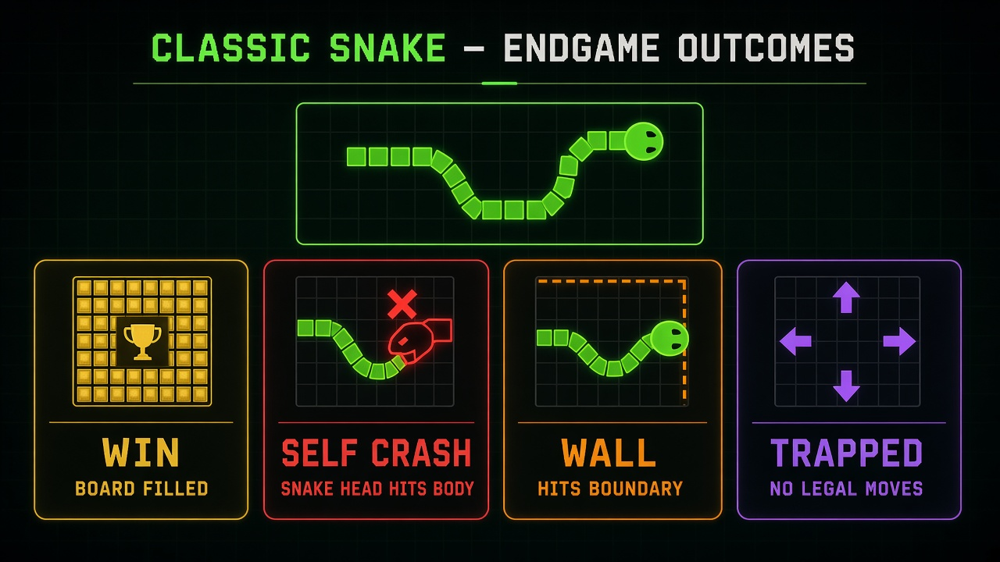
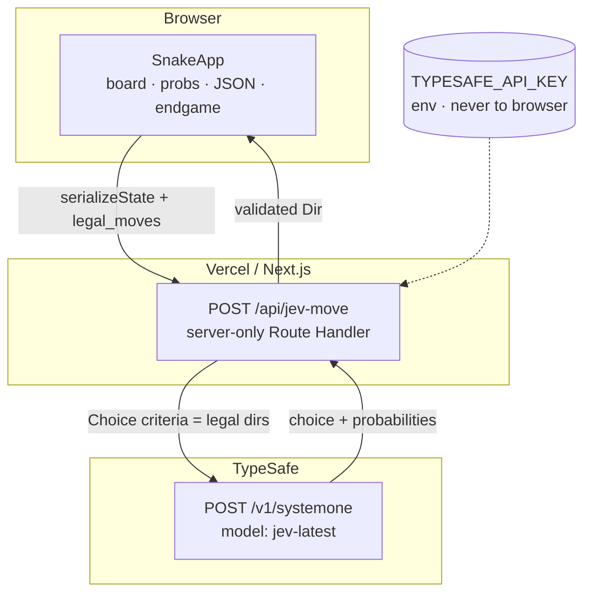
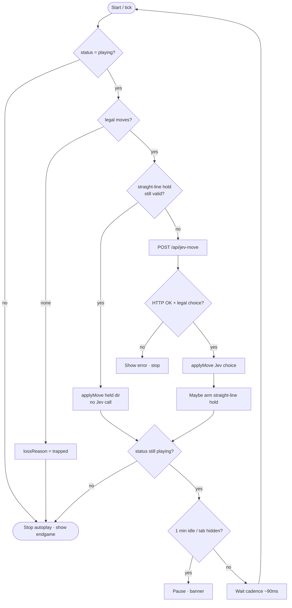
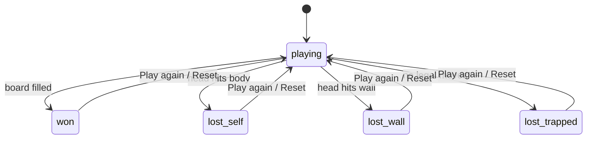

# Jev Snake (Web)

Snake autoplay where **every move decision** is a live TypeSafe Jev Choice via `POST https://api.typesafe.ai/v1/systemone`. Safe straight-line holds may reuse the last legal Jev direction without a new API call.


## Live

| | |
|---|---|
| Production | https://jev-snake-theta.vercel.app |
| Vercel project | https://vercel.com/apptonics-projects/jev-snake |
| GitHub | https://github.com/lalitsonawane/jev-snake |

## Win & lose (classic rules)

| Outcome | Rule |
|---------|------|
| **Win** | Snake length fills the board (`length === width × height`) |
| **Self crash** | Head moves onto a body cell (not the vacating tail) |
| **Wall** | Head leaves the board |
| **Trapped** | No legal moves remain |



## Architecture



## Autoplay tick flow



## Endgame state machine



## Security

`TYPESAFE_API_KEY` (alias `TYPE_SAFE_API_KEY`) is read **only** in `src/app/api/jev-move/route.ts`. Never sent to the browser.

## Local

```bash
export TYPESAFE_API_KEY=...
npm install
npm run dev
```

```bash
npm test    # vitest
npm run build
```

## Vercel

GitHub-linked project: `lalitsonawane/jev-snake` → [apptonics-projects/jev-snake](https://vercel.com/apptonics-projects/jev-snake).

- Pushes to `main` → production
- Other branches → preview
- Env: `TYPESAFE_API_KEY` on Production + Preview (+ Development for `vercel env pull`)

## Docs map

| Doc | Purpose |
|-----|---------|
| [docs/architecture.md](docs/architecture.md) | Deep flows (Mermaid) |
| [docs/notion-sync.md](docs/notion-sync.md) | Repo ↔ Notion index |
| [docs/notes/](docs/notes/) | Session / decision mirrors |
