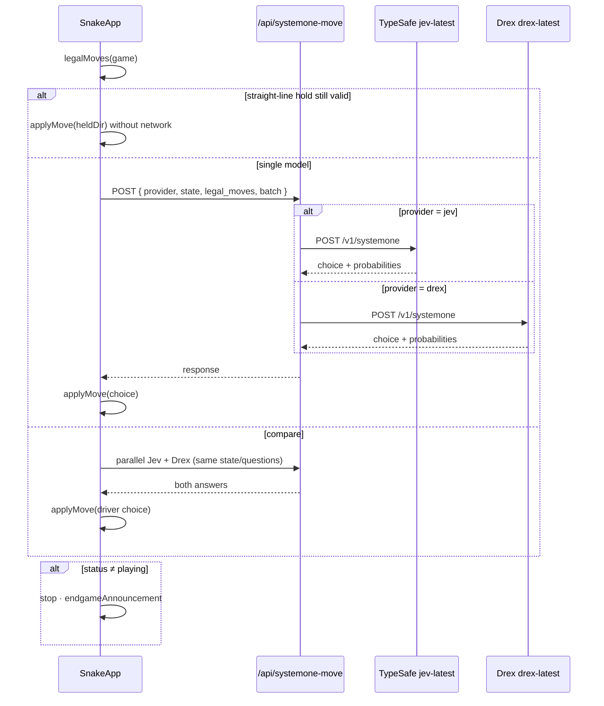
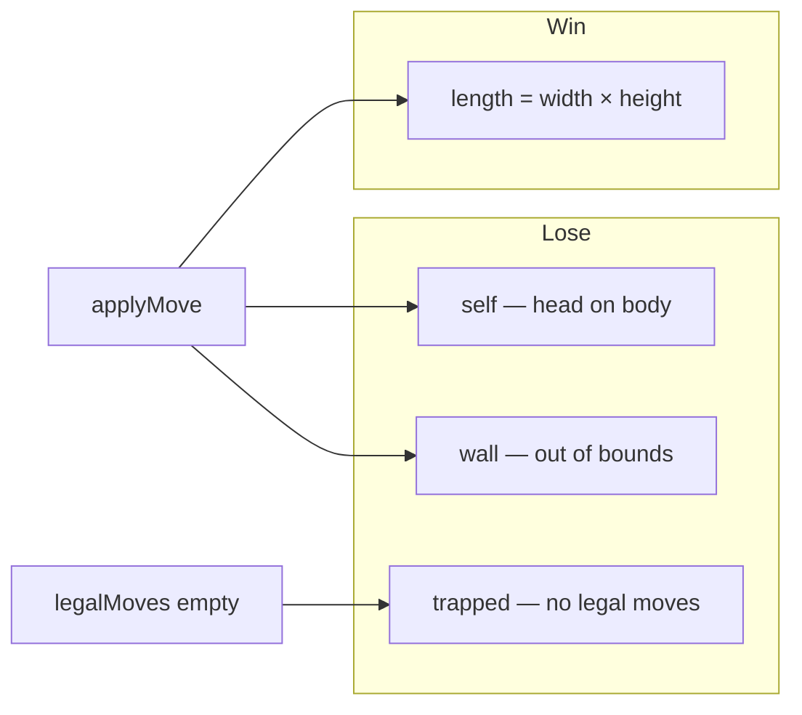
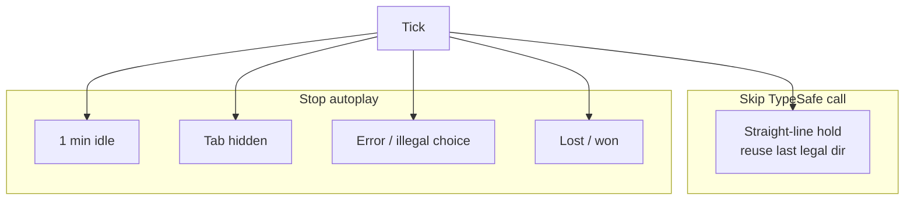
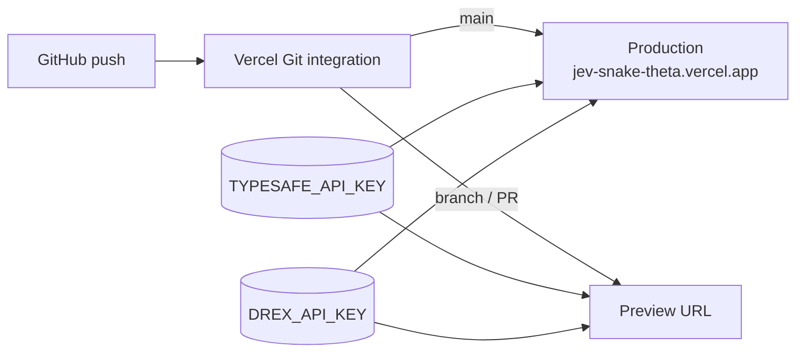

# Jev Snake — architecture

Repo mirror for the system design. Companion Notion page: https://app.notion.com/p/3e489f54d2c281fba90dda670039ba34 (also listed in [notion-sync.md](notion-sync.md)).

## Components

| Layer | Path | Role |
|-------|------|------|
| UI | `src/components/SnakeApp.tsx` | Autoplay loop, Jev/Drex/Compare, board, probs, JSON, endgame |
| Rules | `src/lib/snake.ts` | Moves, legal dirs, straight-line holds, win/lose, serializeState |
| Providers | `src/lib/systemone.ts` | Jev + Drex env, payload build, response shape |
| API | `src/app/api/systemone-move/route.ts` | Server-only System One call (`provider: jev \| drex`) |
| Alias | `src/app/api/jev-move/route.ts` | Jev-only alias of systemone-move |
| Host | Vercel project `jev-snake` | GitHub deploys from `main` |

## Request path

## Env (server-only)

| Provider | Key | Base URL | Default base | Model |
|----------|-----|----------|--------------|-------|
| Jev | `TYPESAFE_API_KEY` | `TYPESAFE_BASE_URL` (optional) | `https://api.typesafe.ai` | `jev-latest` |
| Drex | `DREX_API_KEY` | `DREX_BASE_URL` (**required**) | none (`api.drex.ai` does not resolve) | `drex-latest` |

## Game rules

`endgameAnnouncement(game)` maps:

| `status` / `lossReason` | Title | Detail |
|-------------------------|-------|--------|
| `won` | Board cleared | Filled every cell |
| `lost` / `self` | Game over | Crashed into itself while maneuvering |
| `lost` / `wall` | Game over | Hit the wall |
| `lost` / `trapped` | Game over | No safe moves left |

## Token-saving behaviors

## Deploy pipeline

## Related notes

- [2026-09-26 Jev / Drex compare](notes/2026-09-26-jev-drex-compare.md)
- [2026-09-23 Vercel GitHub link](notes/2026-09-23-vercel-github-link.md)
- [2026-09-23 Documentation refresh](notes/2026-09-23-docs-architecture.md)
- [2026-09-23 Straight-line hold](notes/2026-09-23-straight-line-hold.md)
- [2026-09-23 Idle auto-pause](notes/2026-09-23-idle-auto-pause.md)
- [2026-09-23 Endgame self-crash](notes/2026-09-23-endgame-self-crash.md)
