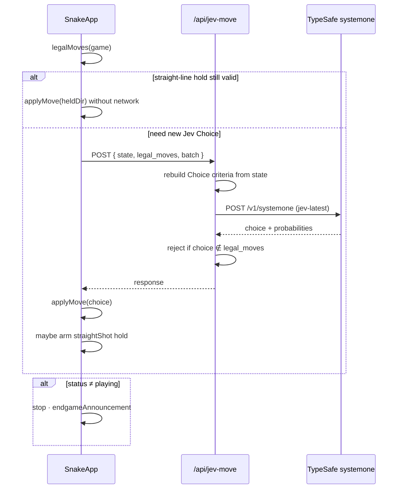
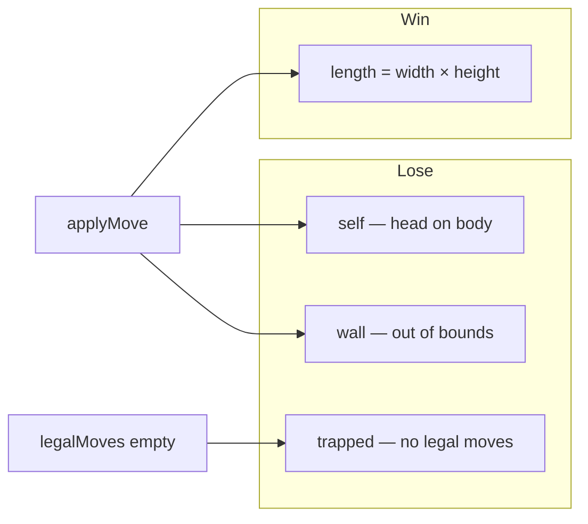
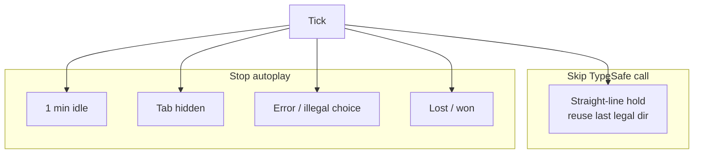
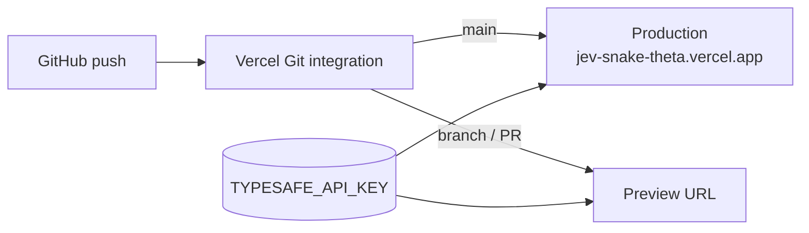

# Jev Snake — architecture

Repo mirror for the system design. Companion Notion page: https://app.notion.com/p/3e489f54d2c281fba90dda670039ba34 (also listed in [notion-sync.md](notion-sync.md)).

## Components

| Layer | Path | Role |
|-------|------|------|
| UI | `src/components/SnakeApp.tsx` | Autoplay loop, board, probs, JSON, endgame overlay |
| Rules | `src/lib/snake.ts` | Moves, legal dirs, straight-line holds, win/lose, serializeState |
| API | `src/app/api/jev-move/route.ts` | Server-only TypeSafe call + choice validation |
| Host | Vercel project `jev-snake` | GitHub deploys from `main` |

## Request path

## Game rules

`endgameAnnouncement(game)` maps:

| `status` / `lossReason` | Title | Detail |
|-------------------------|-------|--------|
| `won` | Board cleared | Filled every cell |
| `lost` / `self` | Game over | Crashed into itself while maneuvering |
| `lost` / `wall` | Game over | Hit the wall |
| `lost` / `trapped` | Game over | No safe moves left |

## Token-saving behaviors

## Deploy pipeline

## Related notes

- [2026-09-23 Vercel GitHub link](notes/2026-09-23-vercel-github-link.md)
- [2026-09-23 Documentation refresh](notes/2026-09-23-docs-architecture.md)
- [2026-09-23 Straight-line hold](notes/2026-09-23-straight-line-hold.md)
- [2026-09-23 Idle auto-pause](notes/2026-09-23-idle-auto-pause.md)
- [2026-09-23 Endgame self-crash](notes/2026-09-23-endgame-self-crash.md)
