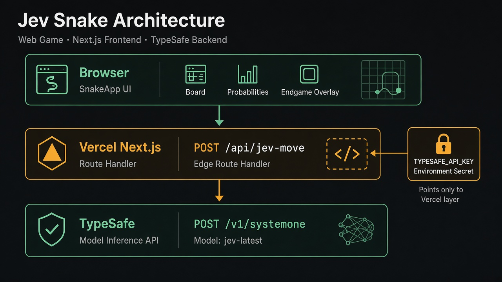
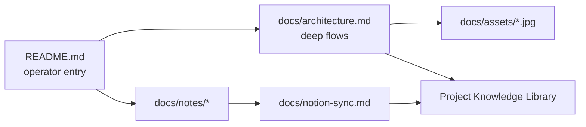

# 2026-09-23 — Jev One — Documentation refresh (architecture + Mermaid)

## Outcome

Refreshed all project documents with system graphics and Mermaid flow diagrams covering architecture, autoplay, endgame, token-saving, and Vercel deploy.

Repo mirror: `docs/notes/2026-09-23-docs-architecture.md`  
Notion: https://app.notion.com/p/3e489f54d2c281b0bc7ddbaa1f28ec07

## Doc map

## Key decisions

- Keep diagrams in-repo under `docs/assets/` so README and `docs/architecture.md` render on GitHub.
- Mirror the same Mermaid blocks into Notion Project Knowledge Library (Notion supports `mermaid` fences).
- Treat README as the operator entrypoint; `docs/architecture.md` as the deep reference.

## Artifacts / links

- `README.md` — overview + Mermaid + graphics
- `docs/architecture.md` — sequence / state / deploy diagrams
- `docs/assets/jev-snake-architecture.jpg`
- `docs/assets/jev-snake-endgame.jpg`
- Production: https://jev-snake-theta.vercel.app

## Open follow-ups

- Merge open PRs (#5 idle 1 min, #6 endgame) so `main` matches documented endgame + idle behavior.
- Archive `jev-snake-cloud-copy` after confirming no remaining need.
