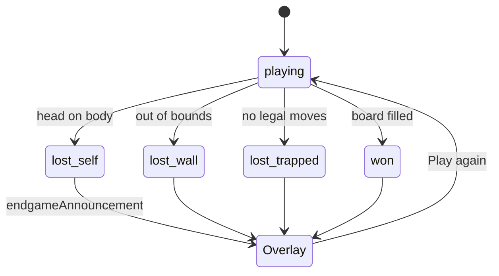

# 2026-09-23 — Jev One — classic self-crash endgame

## Outcome

Added classic self-collision endgame announcement: when the snake’s head hits its body, the UI shows a board overlay (“Game over — The snake crashed into itself while maneuvering”) with score / length / steps and **Play again**.

Repo mirror: `docs/notes/2026-09-23-endgame-self-crash.md`  
Notion: https://app.notion.com/p/3e489f54d2c281a69a1fd78bf1458b05

## Flow

## Key decisions

- Track `lossReason`: `self` | `wall` | `trapped`.
- Self-crash is the headline classic rule; wall/trapped/won share the same overlay pattern.
- Status pill shows **Self crash** for `lossReason === "self"`.

## Artifacts / links

- PR: https://github.com/lalitsonawane/jev-snake/pull/6
- `src/lib/snake.ts` — `lossReason`, `endgameAnnouncement`
- `src/components/SnakeApp.tsx` — overlay
- Graphic: `docs/assets/jev-snake-endgame.jpg`

## Verification

- `npm test` covers self + wall loss reasons.
- `npm run build` passes.
