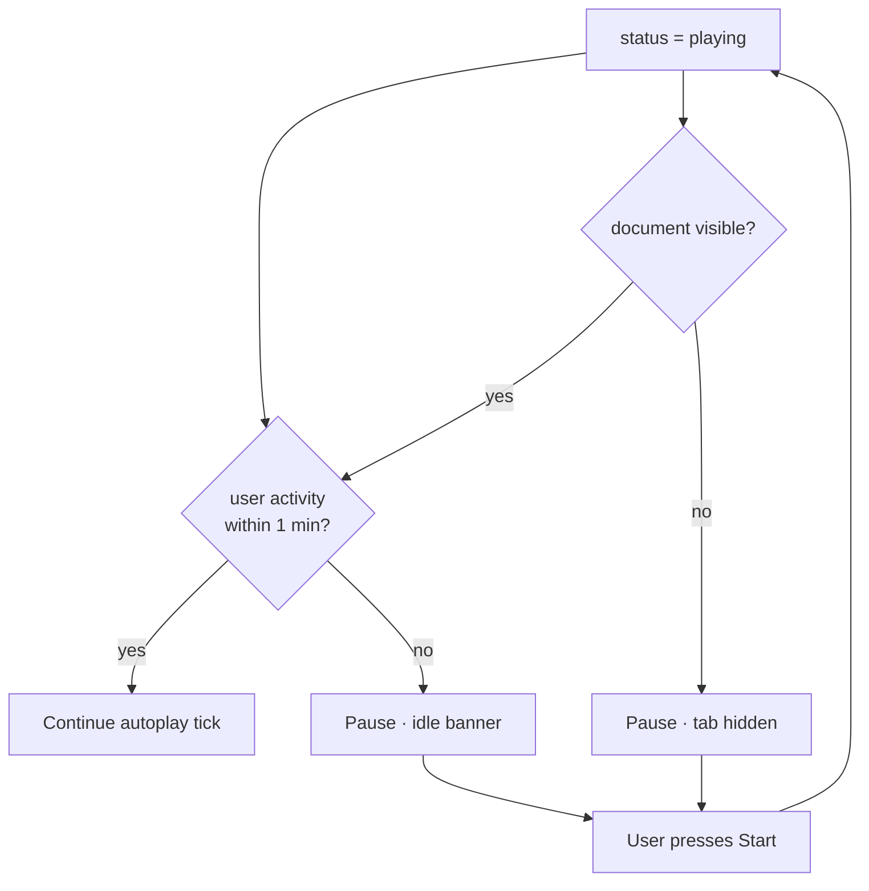

# 2026-09-23 — Jev One — 1-minute idle auto-pause

## Outcome

Autoplay pauses after **1 minute** without user interaction (`AUTOPLAY_IDLE_MS = 60_000`), with a banner and resume via Start. Also pauses when the tab is hidden.

Repo mirror: `docs/notes/2026-09-23-idle-auto-pause.md`  
Notion: https://app.notion.com/p/3e489f54d2c2815eb106df70dbfe03c3

## Flow

## Key decisions

- Idle timer resets on pointer / key / touch / Start.
- Idle pause is separate from game endgame (won/lost); it does not set `lossReason`.
- Prefer this over continuous Jev polling when the player walks away.

## Artifacts / links

- PR: https://github.com/lalitsonawane/jev-snake/pull/5
- `src/components/SnakeApp.tsx` — idle + visibility handlers
- Production: https://jev-snake-theta.vercel.app

## Open follow-ups

- Merge PR #5 to `main` if still open so production and docs stay aligned.
