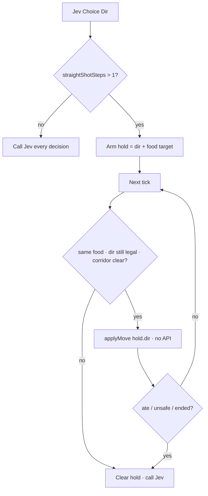

# 2026-09-23 — Jev One — straight-line hold latency

## Outcome

Shipped safe straight-line holds so autoplay reuses Jev’s last legal direction while food is an unobstructed straight shot, skipping TypeSafe API ticks until eat / unsafe / pause / reset. Merged as [PR #4](https://github.com/lalitsonawane/jev-snake/pull/4).

Repo mirror: `docs/notes/2026-09-23-straight-line-hold.md`  
Notion: https://app.notion.com/p/3e489f54d2c28155845cffae4928b037

## Flow

## Key decisions

- Hold only after a legal Jev choice points exactly at current food through a body-free corridor; revalidate every reused move.
- Discard hold on eat, target change, unsafe corridor, pause/reset, or game end.
- Abort in-flight client requests on pause/reset; count network time toward ~90ms cadence.
- Held ticks must not fabricate a new Jev payload.

## Artifacts / links

- PR: https://github.com/lalitsonawane/jev-snake/pull/4
- Production: https://jev-snake-theta.vercel.app
- `src/lib/snake.ts` — `straightShotSteps`
- `src/components/SnakeApp.tsx` — hold loop

## Open follow-ups

- Client abort does not cancel the route’s upstream Jev fetch (billable residual).
