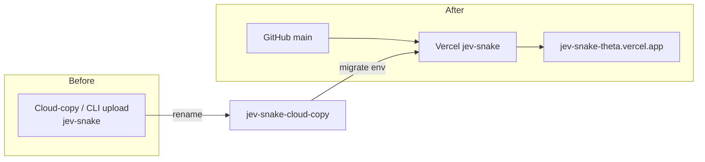

# 2026-09-23 — Jev One — Vercel GitHub link (replace cloud copy)

## Outcome

Connected `github.com/lalitsonawane/jev-snake` to Vercel project **jev-snake** so pushes auto-deploy. Renamed the previous upload/cloud-copy project to `jev-snake-cloud-copy`, then migrated `TYPESAFE_API_KEY` onto the GitHub-linked project.

Repo mirror: `docs/notes/2026-09-23-vercel-github-link.md`  
Notion: https://app.notion.com/p/3e489f54d2c28126b5c6cbba3fb96f2c

## Deploy flow

## Key decisions

- Renamed unlinked cloud-copy to free the `jev-snake` name (`create_git_project` cannot reconnect an unlinked same-name project).
- Provider: **GitHub**, production branch `main`.
- Migrated `TYPESAFE_API_KEY` (Production + Preview + Development); smoke-tested `POST /api/jev-move` → HTTP 200.
- Disabled Vercel Authentication so public `*.vercel.app` works without login.
- Mobile layout: removed 1040px min-width so Start/Reset stay visible.

## Artifacts / links

- Vercel: https://vercel.com/apptonics-projects/jev-snake
- Production: https://jev-snake-theta.vercel.app
- Backup: https://vercel.com/apptonics-projects/jev-snake-cloud-copy
- Architecture docs: [docs/architecture.md](../architecture.md)

## Status

Env migration and public access complete. Prefer GitHub → Vercel path going forward; archive cloud-copy when ready.
